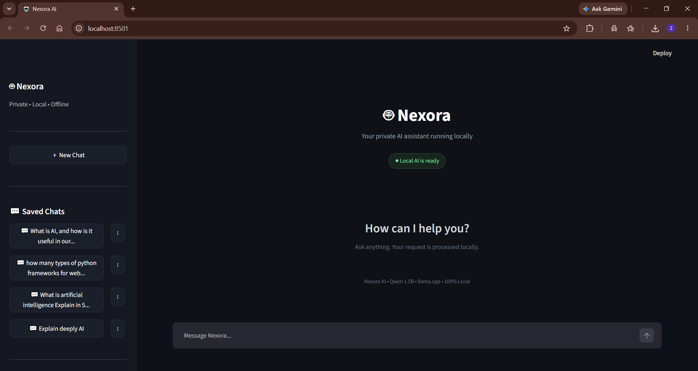

# 🤖 Nexora AI

> A private, local AI assistant powered by Qwen 1.5B and llama.cpp.

Nexora AI is an offline AI chat application built with Python and Streamlit. It connects to a locally running `llama-server` through a local OpenAI-compatible chat-completions endpoint.

## ✨ Features

- 🖥️ Clean Streamlit chat interface
- 🤖 Qwen 1.5B local model
- ⚡ Streaming responses
- 💬 Multiple saved conversations
- ✏️ Rename saved chats
- 🗑️ Delete saved chats
- 🔒 Local/private workflow
- ☁️ No cloud API required

## 📸 Screenshot



## 🛠️ Technologies

- Python
- Streamlit
- Requests
- llama.cpp / llama-server
- Qwen 1.5B
- JSON for local conversation storage

## 📁 Project Structure

```text
Nexora-AI/
├── app.py
├── requirements.txt
├── README.md
├── .gitignore
├── LICENSE
├── screenshots/
└── data/
```

## ⚙️ Requirements

- Python 3.10+
- `llama-server` from llama.cpp
- Qwen 1.5B GGUF model
- A computer capable of running the selected local model

## 🚀 Setup

### 1. Clone the repository

```bash
git clone https://github.com/zahidali-dev01/Nexora-AI.git
cd Nexora-AI
```

### 2. Create a virtual environment

Windows:

```bash
python -m venv venv
venv\Scripts\activate
```

### 3. Install Python dependencies

```bash
pip install -r requirements.txt
```

### 4. Start llama-server

Nexora AI is configured to send requests to:

```text
http://127.0.0.1:8080/v1/chat/completions
```

Start `llama-server` with your Qwen 1.5B GGUF model and make sure it is listening on port `8080`.

### 5. Run Nexora AI

```bash
streamlit run app.py
```

Then open the local Streamlit address shown in your terminal.

## 🧠 How It Works

```text
User
  ↓
Streamlit UI
  ↓
Nexora AI (app.py)
  ↓
Local HTTP Request
  ↓
llama-server :8080
  ↓
Qwen 1.5B
  ↓
Streaming Response
  ↓
Streamlit UI
```

## 🔐 Privacy

Nexora AI is designed to communicate with a local AI server. The application itself uses the local endpoint `127.0.0.1`, so it does not require a cloud AI API for generation.

Saved conversations are stored locally by the application in its `chats` folder.

## 🎯 Learning Goals

This project helped explore:

- Local LLM integration
- OpenAI-compatible local APIs
- Streaming AI responses
- Streamlit chat interfaces
- Local conversation persistence
- Python HTTP requests

## 🔮 Future Improvements

- Model selector
- Adjustable temperature and token settings
- RAG/document chat
- File uploads
- Voice input/output
- Better chat search
- More model support

## 👨‍💻 Author

**Zahid Ali**

BSCS Student | AI & Automation Enthusiast

## 📄 License

MIT License
